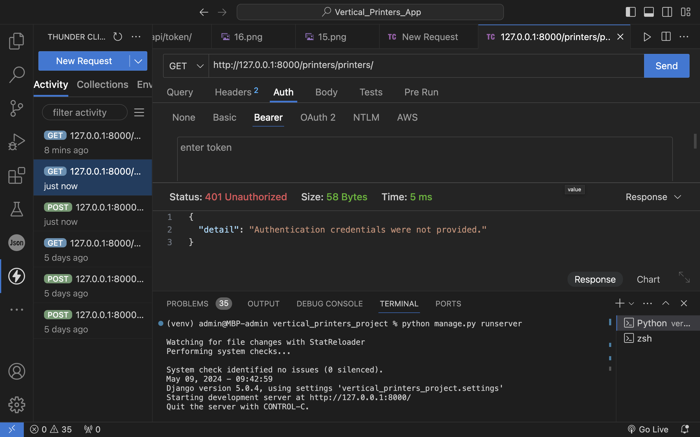

<h1>Vertical printers App</h1>

<h4>Vertical Printers App is an innovative application created specifically for artists and creative individuals who want to turn their digital works and art into real objects through printing on printers.</h4>

<h2>How our model look in Figma</h2>

<a href="https://www.figma.com/design/kbwSyREyVd2byNGplYdHqo/Untitled?node-id=0%3A1&t=lI2AKQH4TOVk9jRp-1">Figma link</a>

<h2>Requriments for our project</h2>
 
 <h4>Requirements:

1) Create a project: database, architecture, minimum 3 apps, API, Postman or Swagger.
2) Upload the project to GitHub (GitLab). The project should include a README file and a link to YouTube.
3) Record a video(any language is optional) and upload it to YouTube.
4) The project can be developed using Django, Spring, NodeJS</h4>

Each person from our team created one app.

 <h2>Apps:</h2>

 <h3>Users App:</h3>
   1.<strong> Admin panel </strong>

   http://127.0.0.1:8000/admin
   
   When you go by this link you will see log in page. Write 
   
   Username: Zhibek
   Password: zhibek123

   Than you will se this:
   
   On it you can see Tokens, SuperUsers and Users.

   Tokens
   

   SuperUsers
   

   Users
   

   2.<strong>Users list</strong>

   http://127.0.0.1:8000/users/list/

   You can see Users not only on admin page, but also from API.

   

   When you adding User, deleting or updating you will need to restart server to see it here.

   3.<strong>Users registartion</strong>

   http://127.0.0.1:8000/users/register/

   Here you can add new Users to dataset. All created Users will have get Token automatically.

   

   Also you do it from Admin Panel.

   

   

   4.<strong>Update Profile</strong>

   http://127.0.0.1:8000/users/40/update_profile/

   Here you can update information of User. Id you can get from the list or Admin Panel.

   

   All fields should be filled.

   

   5.<strong>Delete User</strong>

   http://127.0.0.1:8000/users/40/delete/

   With this function you can delete any User.

   

   

   Changes you can check in Admin Panel and list.

   6.<strong>View profile</strong>

   http://127.0.0.1:8000/users/view_profile/39/

   Here you can check user profile.

   

   7.<strong> Log in</strong>
   
   Go to Thunder Client or http://127.0.0.1:8000/api/token/
   
   Thunder Client
   
   Put http://127.0.0.1:8000/api/token/ and POST
   

   To get Token you need to write SuperUser username and password.

   

   You will get Token.

   

   Same with http://127.0.0.1:8000/api/token/

   

   

   

   After to get access to our app you should copy access Token.

   

   Do new request and to http://127.0.0.1:8000/printers/printers/ and put Token to Bearer.

   

   Eventually you will be authenticated.

   

   Without Token you will get this:

   

